# 前门大栅栏——卤煮

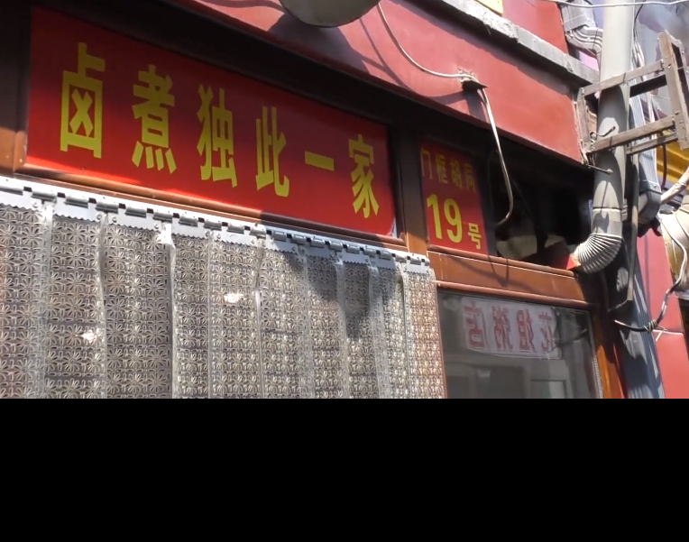

**地址：**认准大栅栏19号

**推荐：**卤煮

标准25+加肠10+火烧

# 北京市中心前门天兴居——炒肝

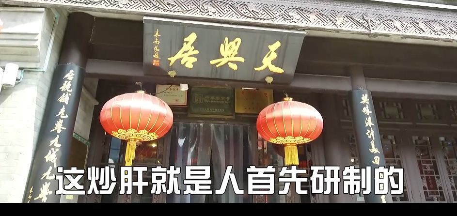

转着喝，不能用勺huo，配包子，不要买那地的卤煮火烧

**推荐：**标配二两包子一碗炒肝，17元

#  牛街老爆肚五香烧牛羊肉——爆肚

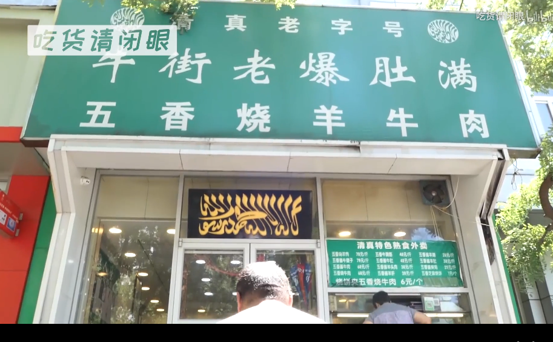

**地址**武圣路49附近（隔壁有家庆丰包子）

**推荐：**肚仁儿 百叶 肚领 烧饼夹牛肉 烫白菜 牛肉面    

**不推荐：**牛肉面

# 炙子烤肉——烤肉刘

**地址：**虎坊桥阡儿胡同 认准牌子

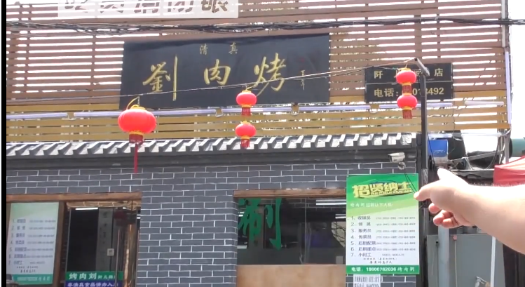

**不推荐：**拌萝卜皮不推荐

没必要要拌料，5元一碗 略贵

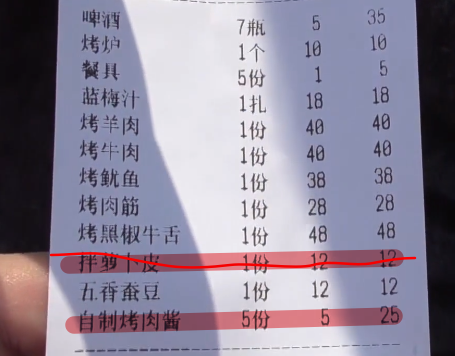

**推荐：**上图推荐

# 铜锅涮肉——聚宝源

**地址：**牛街聚宝源

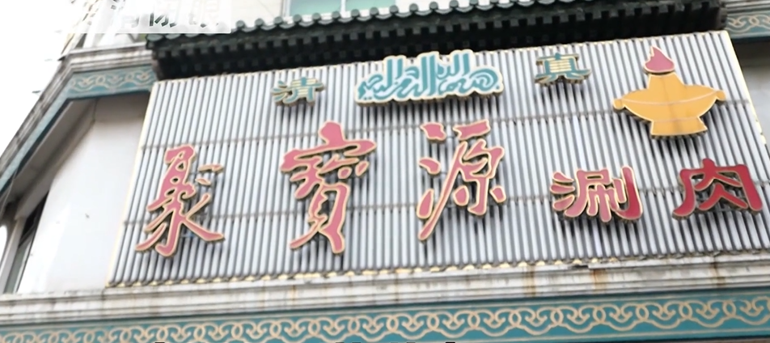

人比较多，可能排好长的队

**推荐：**蔬菜大拼盘  牛眼烧饼   肥牛  手切羊肉 烧烤 臭豆腐加窝头片

出来后可以再去清真超市买小吃

*** 注意 ***

只能用现金

饭后甜点 奶酪魏

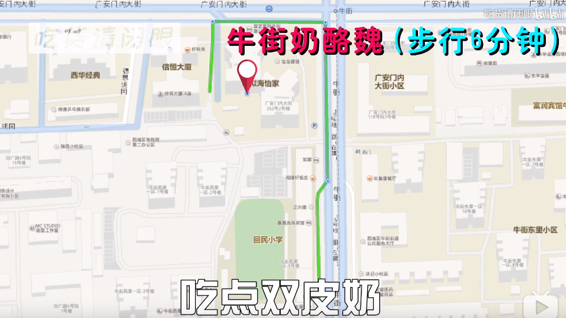

**注意 **

服务员脾气不好

**推荐：**双皮奶  杏仁豆腐  奶酪

# 天坛北门——老磁口豆汁店

**注意**

不能用支付宝微信

用现金

# 炸酱面——顺心宅

**推荐：**唯一推荐就是炸酱面还有打卤面，精品炸酱面。

  其余菜品都不好吃

# 永乐饭庄——烤鸭

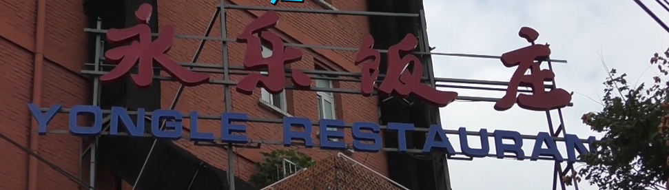 

**地址：**老城区边上  安德路67-3号（六铺炕二巷口）

**推荐：**烤鸭全套   椒盐鸭架子 芥末鸭掌

**不推荐：**茄子 宫保鸡丁

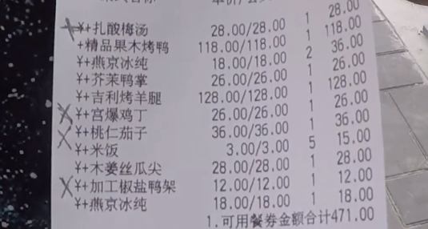

# 白魁老号————烧羊肉

**注意**

只能现金

**推荐：**大蒜烧肚丝  烧羊肉（量少）

扒羊肉条

**地址：**北京市东城区交道口大街158号

# 门钉肉饼——宝瑞门钉肉饼

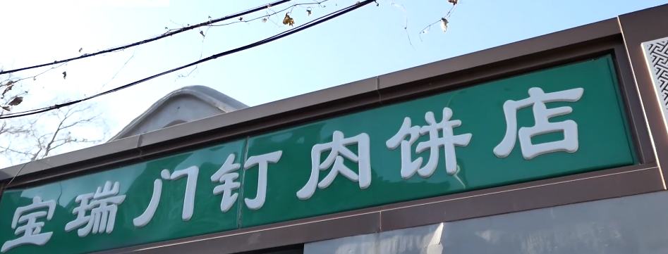

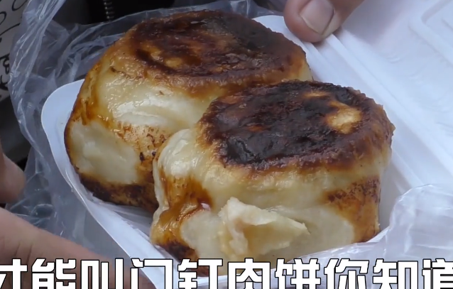五元一个

**地址：**北京市东城区东四六条东口（军区总院南门口）

**优点：**周围可去景点

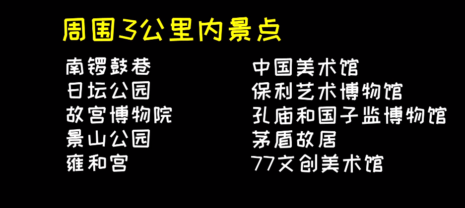

# 老磁器口儿豆汁儿和尹三豆汁天坛那家

**注意**：一般人喝不了

**地址：**尹三豆汁：北京市东城区东晓市街176号（天坛北门向北150米马路东）

**周围景点**

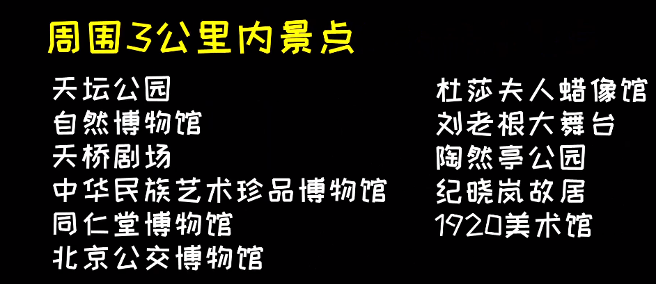

# 特产————火车站还有飞机场所有特产都不推荐

## 不推荐集合

1. 北京烤鸭不能带，最好吃是现烤
2. 北京果脯不要买
3. 茯苓夹饼不要买

##  通州大顺斋糖火烧

**注意：**还是得现金

**推荐**  糖火烧

**不推荐:**  江米条,牛舌头饼（没有稻香村的好吃）

## 北京稻香村点心

## 六必居 、天源酱园的酱菜

## 张一元、 吴裕泰、 正兴德  的花茶

## 大虾酥

## 脸谱

##  甜品——牛街

**注意：**甜品容易坏

种类多，好几十种